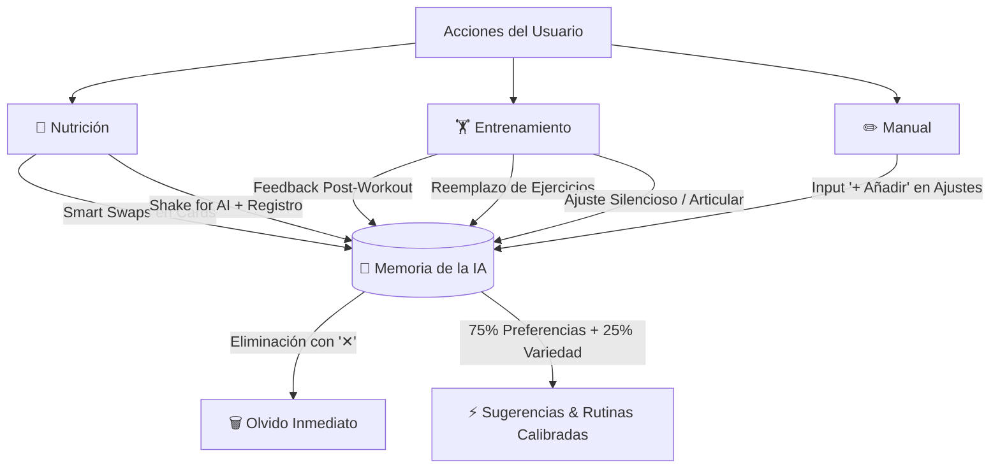

# 🧠 Estructura y Funcionamiento de la Memoria de la IA
### Shakerfy / Studio Pulse Smart

---

## 1. 🎯 Filosofía & Propósito
La **Memoria de la IA** reemplaza los cuestionarios estáticos, formularios rígidos de dietas y listas de alacena interminables por un **sistema vivo de aprendizaje adaptativo**.

* **Cero Fricción Inicial:** El usuario no llena cuestionarios clínicos para empezar.
* **Aprendizaje Orgánico:** La IA extrae patrones reales de lo que el usuario come, rota y califica en sus entrenamientos.
* **Control Total (*User Ownership*):** El usuario puede ver con total transparencia qué recuerda la IA y eliminar cualquier recuerdo con un solo toque (`[ ✕ ]`).
* **Ecosistema Unificado:** Centraliza **Nutrición** y **Entrenamiento** en una única base de conocimiento inteligente.

---

## 2. 🧬 Modelo de Datos (`AiMemoryItem`)

Cada recuerdo almacenado sigue esta estructura tipada en TypeScript:

```typescript
export interface AiMemoryItem {
  id: string;                                                // Identificador único (ej: "mem-178828912")
  text: string;                                              // Contenido legible del aprendizaje
  domain?: "nutricion" | "entrenamiento";                    // Dominio principal
  category?:                                                 // Categoría biomecánica o nutricional
    | "proteina"      // Fuentes proteicas favoritas (tofu, pollo, huevos, etc.)
    | "carbo"         // Carbohidratos y granos (masa madre, avena, quinoa, etc.)
    | "grasa"         // Grasas saludables (palta, semillas, frutos secos, etc.)
    | "habito"        // Rutinas y bebidas (leche vegetal, infusiones, etc.)
    | "intensidad"    // Calibración de cargas y RPE (ligero, óptimo, extenuante)
    | "ejercicio"     // Preferencias de variantes o equipamiento
    | "cuidado"       // Protecciones articulares o rutinas de bajo impacto
    | "general";      // Preferencias generales
  createdAt?: string;                                        // Marca de tiempo ISO
}
```

---

## 3. 🔄 Puntos de Captura y Aprendizaje Automático (Triggers)



### 🥗 A. En Nutrición
1. **Rotación de Ingredientes (*Smart Swaps*):**
   - Cuando el usuario rota repetidamente un ingrediente (ej. *pollo ➔ tofu* o *leche ➔ bebida de almendras*), la IA infiere y consolida la preferencia en la memoria.
2. **Registro en el Diario (*Shake for AI*):**
   - Los platos registrados consolidan los ratios de macronutrientes preferidos en cada momento solar (desayuno, almuerzo, merienda, cena).

### 🏋️ B. En Entrenamiento
1. **Feedback Post-Sesión (*Ligero / Perfecto / Extenuante*):**
   - **Ligero:** La IA aprende que el estímulo fue bajo y registra incrementar volumen o carga (+5-10%) en el próximo ciclo.
   - **Extenuante:** Registra que el grupo muscular llegó al límite y sugiere mayor descanso entre series.
   - **Perfecto:** Registra la cadencia y progresión biomecánica óptima.
2. **Preferencias Biomecánicas & Articulares:**
   - Si el usuario activa rutinas silenciosas o reemplaza ejercicios de impacto, la IA registra la preferencia de bajo impacto.

### ✏️ C. Entrada Manual & Edición
- El usuario puede escribir cualquier gusto o aclaración en el campo de texto de la pantalla (ej. *"Prefiero no cenar con picantes"* o *"Press inclinado con mancuernas en lugar de barra"*).
- La IA clasifica automáticamente el dominio (`nutricion` vs `entrenamiento`) y la categoría correspondiente mediante análisis de palabras clave.

---

## 4. 📱 Interfaz de Usuario (`app?tab=config` ➔ *Memoria de la IA*)

La pantalla cuenta con:
1. **Indicador de Estado:** Píldora pulsante `🟢 Aprendizaje Activo`.
2. **Filtros por Pestañas:**
   - `[ Todos (N) ]`
   - `[ 🥗 Nutrición (N) ]`
   - `[ 🏋️ Entrenamiento (N) ]`
3. **Badges de Categoría Visuales:**
   - `🥗 Proteína` (Índigo) | `🌾 Carbohidrato` (Ámbar) | `🥑 Grasa` (Esmeralda) | `☕ Hábito` (Cielo)
   - `🏋️ Intensidad` (Naranja) | `⚡ Ejercicio` (Púrpura) | `🛡️ Cuidado` (Rosa)
4. **Acción de Olvido en 1 Toque (`[ ✕ ]`):**
   - Elimina el recuerdo inmediatamente con respuesta háptica y notificación toast.
5. **Reset General:**
   - Permite vaciar toda la memoria con un clic para reiniciar el aprendizaje.

---

## 5. ⚖️ Regla Anti-Burbuja (Calibración Equilibrada)
Para evitar que la IA caiga en el "efecto burbuja" (recomendar siempre exactamente lo mismo hasta aburrir al usuario):
* **75% de Base Personalizada:** Respeta estrictamente los recuerdos almacenados (proteínas favoritas, intolerancias percibidas, variantes preferidas).
* **25% de Variedad Saludable:** Mantiene alternativas universales y nuevos alimentos en los *Smart Swaps* para asegurar un espectro completo de micronutrientes y estímulos neuromusculares.

---

## 6. 💾 Persistencia
Los recuerdos se persisten en el almacenamiento local del cliente bajo la clave:
`localStorage.getItem("shakerfy_ai_memory")`
Se cargan con valores por defecto contextuales listos para usar en la primera sesión y mutan orgánicamente con el uso.
