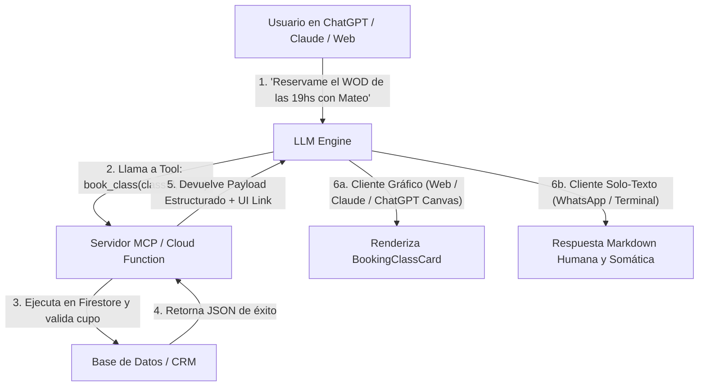

# 🔌 Guía Oficial de Arquitectura para Conectores MCP y Widgets Isomórficos
### The Wellness Face / Shakerfy — AI-Native Studio OS

Esta guía define el estándar técnico obligatorio para que el ecosistema de The Wellness Face funcione de manera nativa e indistinta tanto dentro de nuestra propia **Web App (PWA)** como a través de **Conectores MCP (Model Context Protocol)** en **ChatGPT, Claude, Gemini o WhatsApp**.

---

## 1. 🌐 La Arquitectura Isomórfica de 3 Capas

Un conector MCP no devuelve interfaces pesadas ni código acoplado; devuelve **datos estructurados puros** y una **referencia al widget interactivo**.



---

## 2. 🛠️ Las 4 Tools MCP Esenciales

El servidor MCP expone 4 herramientas estándar que mapean las acciones clave de los gimnasios y los alumnos:

| Tool MCP | Propósito | Argumentos Clave | Retorno / UI Asociada |
| :--- | :--- | :--- | :--- |
| `search_classes` | Consultar grilla de clases, profes y cupos disponibles. | `gymId`, `date`, `activityType` | Lista de horarios + `BookingClassCard` |
| `book_class` | Reservar cupo de alumno usando código temporal `WF-XXXX`. | `classId`, `linkCode` | Confirmación + `BookingClassCard` (modo reservada) |
| `get_member_status` | Consultar créditos restantes, vencimiento y apto médico. | `linkCode` | `MembershipStatusCard` |
| `log_nutrition_scan` | Registrar comida con análisis nutricional consciente. | `linkCode`, `description`, `photoUrl` | `MealTimelineCard` (26 reglas) |

### Ejemplo de Especificación Tool MCP (JSON Schema):
```json
{
  "name": "book_class",
  "description": "Reserva un cupo para el alumno en la clase indicada del estudio.",
  "parameters": {
    "type": "object",
    "properties": {
      "classId": { "type": "string", "description": "ID de la clase en el gimnasio" },
      "linkCode": { "type": "string", "description": "Código de vinculación del alumno (ej. WF-8492)" }
    },
    "required": ["classId", "linkCode"]
  }
}
```

---

## 3. 📐 Los 5 Mandamientos de los Componentes MCP (`src/components/widgets/`)

Todos los widgets que se renderizan vía conector o dentro de la app deben cumplir estrictamente estas 5 reglas:

### Regla 1: 100% "Props-Driven" (Desacople Total de Rutas)
* **PROHIBIDO:** Usar `useNavigate`, `useRouter`, `Route.useSearch()`, o links directos `<Link to="/...">` dentro del widget.
* **OBLIGATORIO:** Cualquier acción externa debe ser emitida mediante **callbacks funcionales**:
  ```tsx
  //  CORRECTO
  export interface BookingClassCardProps {
    classItem: GymClassItem;
    onBook?: (classId: string) => Promise<void> | void;
    onCancel?: (classId: string) => Promise<void> | void;
    onOpenDetails?: (classId: string) => void;
  }
  ```
  *Razón:* Si el widget se monta en un Iframe de ChatGPT o en un Artifact de Claude, el Router de TanStack no existe.

### Regla 2: Autonomía de Ancho y Layout Móvil
* Las ventanas de chat de ChatGPT o paneles laterales de Claude suelen tener anchos estrechos (entre **320px y 420px**).
* **OBLIGATORIO:** Todo widget debe tener contenedor fluido `w-full max-w-[380px] sm:max-w-md mx-auto`.
* Uso estricto de clases de Shadcn/Radix con bordes redondeados `rounded-3xl` o `rounded-2xl` y fondo de tarjeta `bg-card border border-border/80`.

### Regla 3: Feedback Multisensorial Integrado (Háptica y Web Audio)
* El usuario interactúa tocando la tarjeta en su pantalla táctil.
* Toda acción de éxito debe incluir:
  ```ts
  if (typeof navigator !== "undefined" && navigator.vibrate) {
    navigator.vibrate(25); // Micro-vibración háptica estándar
  }
  ```

### Regla 4: Dualidad de Entrega (Visual + Fallback de Texto Somático)
* No todos los clientes soportan componentes interactivos (ej: si el usuario consulta por **WhatsApp**).
* Cada Tool MCP debe devolver **siempre** un bloque de texto humano y conciso según la **Regla 12 de AGENTS.md (UX Writing: Beneficio sobre Mecanismo / iPod Rule)**:
  -  *"Tenés tu lugar reservado para las 19:00hs con Mateo. Quedan 4 cupos en la sala."*
  - ❌ *"Se ha ejecutado la mutación de clase con éxito. Saldo: 3 créditos."*

### Regla 5: Cumplimiento de las 26 Reglas Nutricionales
* Si el widget es de nutrición (`MealTimelineCard`):
  - **Cero moralidad alimentaria:** Nada de "comida trampa" o "quema calorías".
  - **Cero números calóricos punitivos:** La porción se comunica en **Porciones de Mano** (Palma de proteína, Puño de granos, Pulgar de grasas).
  - **Fit del momento:** Solo mostrar badges contextuales si hay evento real (*"Ideal Post-Entreno"*).

---

## 4. 🗂️ Inventario de Widgets Oficiales

Ubicación: [`src/components/widgets/`](file:///c:/Users/shake/.gemini/antigravity/scratch/studio-pulse-smart/src/components/widgets/)

1. [`booking-class-card.tsx`](file:///c:/Users/shake/.gemini/antigravity/scratch/studio-pulse-smart/src/components/widgets/booking-class-card.tsx):
   - Muestra clase, profesor, horario, badges de cupos y botón de reserva en 2 toques.
   - Soporta estado de "Ya reservada" con botón de cancelación y política de cancelación anticipada.
2. [`membership-status-card.tsx`](file:///c:/Users/shake/.gemini/antigravity/scratch/studio-pulse-smart/src/components/widgets/membership-status-card.tsx):
   - Muestra plan del alumno, créditos restantes, fecha de vencimiento y botón de 1 toque para copiar el código IA (`WF-XXXX`).
3. [`meal-timeline-card.tsx`](file:///c:/Users/shake/.gemini/antigravity/scratch/studio-pulse-smart/src/components/widgets/meal-timeline-card.tsx):
   - Renderiza platos escaneados o anotados con doble toque para favoritos, badges somáticos y sugerencia de adición positiva.
4. [`gym-map-pin-card.tsx`](file:///c:/Users/shake/.gemini/antigravity/scratch/studio-pulse-smart/src/components/widgets/gym-map-pin-card.tsx):
   - Tarjeta de previsualización del estudio/gimnasio con dirección, amenidades destacadas y botón de reserva de clase de prueba.

---

## 5. 🚀 Cómo se sirve un Widget hacia ChatGPT / Claude

Para que ChatGPT o Claude muestren el widget en vivo, el endpoint del conector utiliza dos métodos estándar:

### Método A: Endpoint de Renderizado Embebido (El estándar para ChatGPT Actions)
Se crea una ruta pública ligera en nuestra app:
`https://app.thewellnessface.com/embed/booking?classId=123&code=WF-8492`
El LLM devuelve un iframe seguro o un botón de acción interactivo que abre la vista embebida sin barras de navegación ni menús innecesarios (`hideHeader=true`).

### Método B: MCP Resource / UI Tool Result (Para Claude Desktop & MCP Hosts nativos)
El servidor MCP implementa el protocolo de recursos:
```typescript
server.setRequestHandler(CallToolRequestSchema, async (request) => {
  if (request.params.name === "search_classes") {
    const classes = await fetchClasses(request.params.arguments.gymId);
    return {
      content: [
        {
          type: "text",
          text: `Encontré 3 clases disponibles hoy en Kraft Strength Club:`
        },
        {
          type: "resource",
          resource: {
            uri: `widget://classes?gymId=${request.params.arguments.gymId}`,
            mimeType: "application/json",
            text: JSON.stringify(classes)
          }
        }
      ]
    };
  }
});
```

---

## 6. ✅ Checklist de Certificación para Nuevos Widgets

Antes de considerar listo cualquier componente que vaya a exponerse a los conectores de IA:

- [ ] ¿El componente funciona si lo importás en una página vacía sin router?
- [ ] ¿Tiene un ancho máximo controlado (`max-w-[380px]`) que no rompa ventanas de chat?
- [ ] ¿Todas las acciones asíncronas emiten micro-vibración háptica (`navigator.vibrate`)?
- [ ] ¿Respeta el modo claro y oscuro (`dark:bg-card`, `text-foreground`) de forma nativa?
- [ ] ¿Cumple la regla de cero emojis en botones de acción y títulos administrativos?
- [ ] ¿El texto que lo acompaña pasa el "Steve Jobs Test" (cero tecnicismos médicos, foco en confort y bienestar)?
