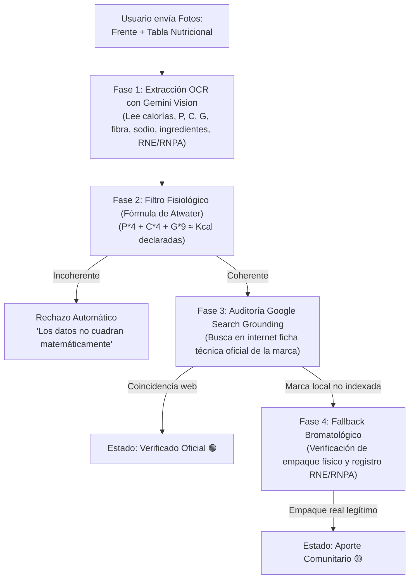

# 🥗 Guía Maestra: Base de Datos de Alimentos, Google Search Grounding y Moderación Comunitaria

**The Wellness Face** — Documento de Arquitectura, Flujos de Usuario y Especificaciones Técnicas.

---

## 1. Visión y Modelo del Ecosistema

El sistema de alimentos de **The Wellness Face** combina **Educación Nutricional**, **Rendimiento Físico** y una **Venta Contextual hacia la Tienda (Dietética)**. 

### 1.1. Dualidad de Modos (Elección del Usuario)
* **Modo Bienestar (Wellness Mode - Por Defecto):**
  * **Objetivo:** *Nutrition Awareness* sin ansiedad de control.
  * **Visualización:** Dial de calidad (`Alto / Medio / Bajo`) + Badges de los 7 Vectores Nutricionales (`Mínimamente procesado`, `Fuente de fibra`, `Aporte proteico`, etc.) + Insights somáticos de confort y digestión.
  * **Oculto:** Conteo de calorías acumuladas, números punitivos o gramos de déficit.
* **Modo Atleta (Athlete Mode):**
  * **Objetivo:** Cuantificación precisa y planificación para metas de gimnasio y recomposición corporal.
  * **Visualización:** Exactamente la misma capa cualitativa del Modo Bienestar **+** desglose cuantitativo: calorías exactas y gramos de macronutrientes (`Proteína`, `Carbohidratos`, `Grasas`, `Fibra`).
  * **Meta Activa:** Seguimiento de objetivos diarios (especialmente el umbral de proteína).

### 1.2. El Embudo de Negocio y Conversión
```
[ Búsqueda manual en Base de Datos: 100% GRATIS ]
                       │
         (Fricción de escribir ingredientes a mano)
                       ▼
[ Muro de Valor PRO: Escáner Multimodal por Foto o Voz ]
                       │
         (Usuario en Modo Atleta detecta déficit de proteína)
                       ▼
[ CTA Contextual hacia la Tienda: Suplementos & Alimentos Proteicos ]
```

---

## 2. Arquitectura de la Base de Datos (3 Capas)

Para garantizar velocidad instantánea (0ms) y costos de infraestructura casi nulos:

```
┌─────────────────────────────────────────────────────────────┐
│ CAPA 1: SEED CURADO LOCAL (150 Alimentos Enteros Básicos)   │
│ • Huevos, pechuga de pollo, avena, arroz, banana, palta... │
│ • Archivo JSON estático en memoria / local cache.           │
│ • Costo de API: $0. Latencia: 0ms. Funciona Offline.        │
└─────────────────────────────────────────────────────────────┘
                               ▲
┌──────────────────────────────┴──────────────────────────────┐
│ CAPA 2: OPEN FOOD FACTS API (Productos Industriales Masivos)│
│ • Consulta por código de barras EAN-13 (Cámara / ZXing).    │
│ • Lectura automática de Nutri-Score, NOVA y Macros por 100g.│
│ • Costo de API: $0 (Base de datos abierta colaborativa).    │
└─────────────────────────────────────────────────────────────┘
                               ▲
┌──────────────────────────────┴──────────────────────────────┐
│ CAPA 3: BASE PROPIETARIA VERIFICADA (Dietética & Marcas)    │
│ • Productos aportados por usuarios (Crowdsourcing).         │
│ • Verificación automatizada con Google Search Grounding.   │
│ • Conexión directa con el inventario de la Tienda.         │
└─────────────────────────────────────────────────────────────┘
```

---

## 3. Flujo de Crowdsourcing (Aporte de Alimentos por el Usuario)

Cuando un usuario no encuentra un producto envasado o un alimento de dietética, puede aportarlo a la plataforma mediante un flujo guiado y sin fricción.

### 3.1. Captura de Datos
1. **Foto Frontal del Empaque:** Nombre del producto, marca comercial y presentación (gramos/ml).
2. **Foto Lateral / Trasera:** Tabla de información nutricional e ingredientes visibles.
3. **Código de Barras (Opcional):** Escaneo con la cámara o carga manual de los 13 dígitos EAN.

### 3.2. Aislamiento Local Inmediato (Anti-Trolls)
> [!IMPORTANT]
> **Regla de Confianza Cero:** Todo producto nuevo subido por un usuario se asigna con el estado `status: "pending_review"` y visibilidad `isCommunityApproved: false`.
> * **En la cuenta del creador:** Queda inmediatamente utilizable en su diario de comidas personal bajo la pestaña *"Mis Alimentos"*.
> * **En el buscador global:** **NO** aparece para el resto de los usuarios hasta haber sido auditado y aprobado. Esto quita el 100% del incentivo a usuarios malintencionados de subir bromas o datos falsos.

---

## 4. Motor de Verificación con Google Search Grounding

Para auditar y validar los alimentos aportados sin intervención manual intensiva:



### 4.1. Filtro Matemático Inviolable (Ecuación de Atwater)
Antes de llamar a cualquier API de búsqueda, el servidor ejecuta la validación matemática:
$$\text{Calorías Calculadas} = (\text{Proteínas} \times 4) + (\text{Carbohidratos} \times 4) + (\text{Grasas} \times 9)$$

* **Tolerancia:** $\pm 10\%$ (debido al impacto calórico de la fibra y polialcoholes).
* Si el producto declara `50 kcal` y contiene `30g de proteína` ($30 \times 4 = 120\text{ kcal}$), el sistema lo descarta inmediatamente como información falsa o error tipográfico.

### 4.2. Implementación de Google Search Grounding con Gemini
Se utiliza el modelo **Gemini Flash** configurado con la herramienta nativa `googleSearch`.

#### Configuración de la Solicitud:
```typescript
import { GoogleGenAI } from "@google/genai";

const ai = new GoogleGenAI({ apiKey: process.env.GEMINI_API_KEY });

export async function verifyProductWithGrounding(productData: {
  brand: string;
  name: string;
  calories: number;
  protein: number;
  carbs: number;
  fat: number;
}) {
  const prompt = `
Actúa como un auditor bromatológico y nutricional estricto.
Verifica si existe en el mercado el siguiente producto:
Marca: "${productData.brand}"
Producto: "${productData.name}"

Valores declarados por el usuario por porción:
- Calorías: ${productData.calories} kcal
- Proteínas: ${productData.protein} g
- Carbohidratos: ${productData.carbs} g
- Grasas: ${productData.fat} g

Utiliza la búsqueda de Google para encontrar la ficha técnica oficial del fabricante, tienda online oficial, supermercados (Coto, Carrefour, Jumbo) o tiendas de dietética confiables.
Compara los valores nutricionales encontrados con los declarados.

Devuelve EXCLUSIVAMENTE un objeto JSON válido con esta estructura:
{
  "productFound": boolean,
  "isMatch": boolean,
  "confidenceScore": number, // 0 a 100
  "officialSourceUrl": string | null,
  "notes": string,
  "officialValues": {
    "servingSize": string,
    "calories": number,
    "protein": number,
    "carbs": number,
    "fat": number
  } | null
}
`;

  const response = await ai.models.generateContent({
    model: "gemini-2.5-flash",
    contents: prompt,
    config: {
      tools: [{ googleSearch: {} }],
      responseMimeType: "application/json",
    },
  });

  return JSON.parse(response.text);
}
```

### 4.3. Fallback para Marcas Locales (Cuando no está en Google)
Si `productFound === false` pero las fotos del usuario muestran un empaque original de fábrica con:
1. Tipografía comercial e impresión industrial de calidad.
2. Número de registro sanitario visible (**RNE / RNPA** en Argentina o equivalente regional).
3. Coherencia matemática de Atwater aprobada.

El producto se aprueba para el catálogo global bajo la categoría **Aporte Comunitario 🟡**.

---

## 5. Sistema de Moderación y Botón "Reportar"

La comunidad actúa como la auditoría continua del catálogo, absorbiendo cambios de fórmulas y erratas.

### 5.1. Insignias de Confianza en la UI
* 🟢 **Verificado Oficial:** Ficha técnica corroborada en la web oficial del fabricante o cargada por el equipo de The Wellness Face.
* 🟡 **Aporte Comunitario:** Validado mediante empaque físico y revisión asistida por IA. Abierto a sugerencias de la comunidad.

### 5.2. Drawer de Reporte (Flow de 2 Toques)
Ubicado de forma discreta dentro del detalle del alimento: `[ ⚠️ Reportar error ]`.

**Opciones de Reporte (Selección rápida):**
1. *Valores nutricionales incorrectos* (con opción de adjuntar nueva foto de la tabla).
2. *Cambio de fórmula o tamaño de porción*.
3. *Producto duplicado o inexistente*.

### 5.3. Regla de Auto-Cuarentena
* **1 o 2 reportes:** Se añade un aviso interno en el panel administrativo.
* **3 reportes independientes:** El producto entra automáticamente en estado `quarantine` y se retira preventivamente del buscador global hasta ser revisado, protegiendo a los demás usuarios.

---

## 6. Especificaciones de UI/UX (Drawers vs. Modales)

En cumplimiento estricto con la **Sección 13 de `AGENTS.md` (Los 5 Modelos Mentales Clave)**:

### 6.1. Comportamiento Adaptativo
* **Dispositivos Móviles (`max-md`):** Se abren como **Bottom Sheets / Drawers** (`Drawer` / `Vaul`), con barra de agarre superior (*pill handle*), arrastrables hacia abajo para descartar (`diffY > 80px`).
* **Pantallas de Escritorio (`md+`):** Mutan fluidamente a un **Dialog modal centrado** (`max-w-md` o `max-w-lg`) con overlay suave `bg-black/40 backdrop-blur-xs`.

### 6.2. Pantallas y Componentes Clave

#### A. Selector de Intención Inicial (Micro-Onboarding)
* Se despliega la **primera vez** que el usuario entra a la pestaña de comidas.
* **Componente:** 2 tarjetas simétricas de estilo plano (`rounded-3xl border border-border p-5 hover:-translate-y-1 hover:border-foreground/30 transition-all`):
  1. *Modo Bienestar:* "Alimentación consciente, digestión y energía sin contar calorías."
  2. *Modo Atleta:* "Control numérico de macros, proteína y calorías para rendimiento."
* Al pie: *"Podés cambiar de modo en cualquier momento desde tu perfil."*

#### B. Buscador de Alimentos (`FoodSearchDrawer`)
* Input de búsqueda superior con autofocus (`placeholder="Buscar alimento o marca..."`).
* Píldoras de filtro rápido: `[ Todos ]` • `[ Alta Proteína ]` • `[ Frutas & Verduras ]` • `[ Mis Creados ]`.
* Fila de alimento con layout de 2 toques:
  * Toque 1: Seleccionar alimento -> Despliega ajuste rápido de porción (`[ 100g ]` o `[ 1 porción ]`).
  * Toque 2: Botón `[ + Agregar al diario ]`.
* Al pie del buscador:
  * Banner secundario: *«¿No lo encontrás? [ + Crear o Escanear nuevo alimento ]»*.

#### C. Creador Colaborativo (`AddCustomFoodDrawer`)
* Selector de 2 fotos (`Foto Frente` y `Foto Tabla Nutricional`).
* Indicador de estado en tiempo real:
  1. *Subiendo fotos...*
  2. *Gemini Vision analizando tabla nutricional...*
  3. *Campos autocompletados con éxito.*
* Campos editables *in-place* por si el usuario desea retocar algún gramo antes de guardar.
* Botón de guardado con auto-persistencia en *"Mis Alimentos"*.

---

## 7. Puente Hacia el E-commerce (Venta de Proteína)

En el **Modo Atleta**, el seguimiento diario de macronutrientes se convierte en el generador natural de compras en la Tienda:

### 7.1. Disparador del Déficit Proteico
* Cuando el usuario tiene una meta de $130\text{g}$ y su total consumido a media tarde es de $70\text{g}$:
  * En la tarjeta superior del diario se renderiza el **CTA de Reabastecimiento**:
    > **Déficit detectado:** Te faltan 60g de proteína para completar tu recuperación de hoy.
    > 
    > `[ 🛒 Ver Opciones en Tienda: Whey Protein & Barritas ]`
* Al tocar el botón, se abre la vista del producto en la Tienda con opción de compra rápida en 1 clic (vía Mercado Pago / Stripe).

---

## 8. Esquema de Datos de Referencia (TypeScript)

```typescript
export interface FoodProduct {
  id: string;
  name: string;
  brand: string;
  barcode?: string;
  category: "whole_food" | "packaged" | "supplement";
  
  // Capa Nutricional Base (por 100g o por porción estándar)
  servingSize: string; // ej: "100g" o "30g (1 scoop)"
  servingWeightGrams: number;
  calories: number;
  protein: number;
  carbs: number;
  fat: number;
  fiber: number;
  sodium: number;

  // Capa Cualitativa (Modo Bienestar)
  bioQualityLevel: 1 | 2 | 3 | 4 | 5; // Mapeado a Alto (4-5), Medio (3), Bajo (1-2)
  novaGroup?: 1 | 2 | 3 | 4; // 1 = natural, 4 = ultraprocesado
  vectorBadges: {
    category: "processing" | "protein" | "fiber" | "sugar" | "fat" | "grains" | "sodium";
    label: string;
  }[];

  // Metadatos de Confianza y Auditoría
  verificationStatus: "verified_official" | "community_approved" | "pending_review" | "quarantine";
  verifiedSourceUrl?: string;
  reportCount: number;
  createdByUserId?: string;
  frontPhotoUrl?: string;
  nutritionPhotoUrl?: string;
  createdAt: string;
  updatedAt: string;
}
```

---

*Documento aprobado para el desarrollo y estandarización del ecosistema de nutrición de The Wellness Face.*
